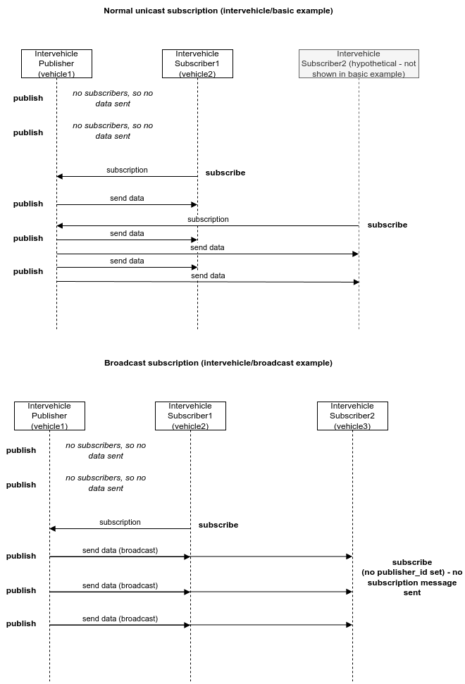

# Intervehicle Broadcast Example

## Overview

This example shows how to use broadcast publications and subscriptions on the Goby3 intervehicle layer. Broadcast messages are implemented differently in each ModemDriver but the common theme is that all nodes within range will receive a single transmission. This means you can potentially publish to a large number of subscriber using a single transmission, but it also precludes the use of acknowledgments (so it is unreliable). Using broadcast is best suited for messages that are superseded by the next message (e.g. vehicle status) if lost. Using the default unicast makes more sense for messages that carry state (e.g., command type messages, or important data).

## Code and Configuration

`publisher.cpp` defines a simple application that publishes a NavigationReport DCCL message once every 10 seconds on the intervehicle layer.

`subscriber.cpp` defines a simple subscriber that subscribes to the NavigationReport DCCL message and writes it to the terminal.

Both of these applications are very similar to the `goby3-examples/src/intervehicle/basic_publisher` and `goby3-examples/src/intervehicle/basic_subscriber`, respectively.

The main differences between the "basic" and "broadcast" examples are:
- The broadcast publisher has no ack or expired callback functions defined as these are inherently not supported when using broadcast publications (you will get an exception if you try to pass an ack callback function when using broadcast).
- The subscriber config (`goby3-examples/launch/intervehicle/broadcast/subscriber-veh2.pb.cfg`) has `intervehicle { broadcast: true }` defined. This labels the subscription as broadcast (rather than the default unicast).

Since only one subscriber and one publisher is needed to actually send a message on the intervehicle layer, we only need one of the potential broadcast subscribers to send an intervehicle subscription. There is no harm in all subscribers sending a subscription, but it does take more data so highly bandwidth constrained systems may want to avoid this.

To illustrate this option, in this example, only vehicle2 actually sends the subscription to vehicle1 (by setting `publisher_id: 1`, as defined in:


```
# goby3-examples/launch/intervehicle/broadcast/subscriber-veh2.pb.cfg
nav_subscriber_cfg {
    intervehicle {
        broadcast: true
        publisher_id: 1
        ...
    }
}
```

As long as vehicle2 is running, any other subscribers can omit sending the subscription message, and will still receive the broadcast message (assuming they are within the broadcast communications range of the intervehicle layer's modem(s)). So for this example we set vehicle3 to not send the subscription message by not setting any publisher_ids:

```
# goby3-examples/launch/intervehicle/broadcast/subscriber-veh3.pb.cfg

nav_subscriber_cfg {    
    intervehicle {
        broadcast: true
        ...
    }
}

```

The following sequence diagram outlines the data flow for the unicast (basic example) and the broadcast (this example):



Note: vehicle3 **could** set a publisher_id and this would work fine, it would just incur the overhead of another message (a subscription from vehicle3 to vehicle1). The best option is dependent on your application and network topology.

## How to run

The order you start the various vehicles doesn't matter, however you won't see messages on the subscriber until you start vehicle 2 and vehicle 1 (as vehicle 3 is dependent on vehicle 2's subscription)

```
cd goby3-examples/launch/intervehicle/broadcast
# start publisher
./broadcast_vehicle1.launch
```

```
cd goby3-examples/launch/intervehicle/broadcast
# start subscriber 1 (actually sends subscription message)
./broadcast_vehicle2.launch
```

```
cd goby3-examples/launch/intervehicle/broadcast
# start subscriber (doesn't send subscription message, but picks up broadcast data since vehicle 2 subscribed)
./broadcast_vehicle3.launch
```
